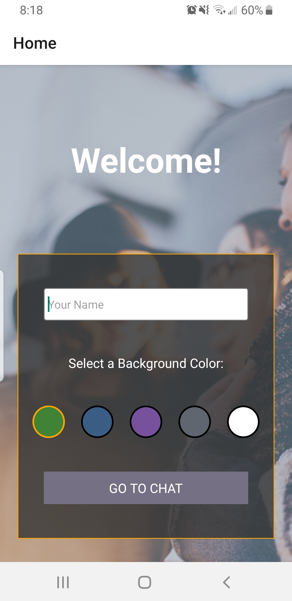
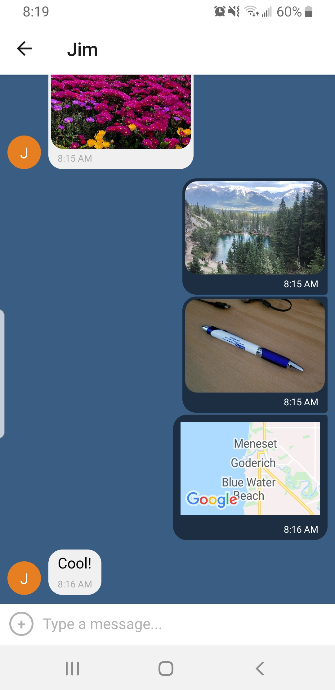
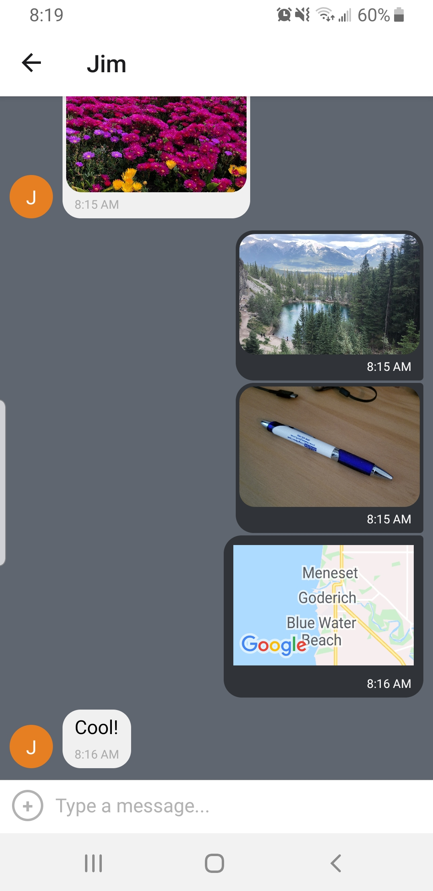
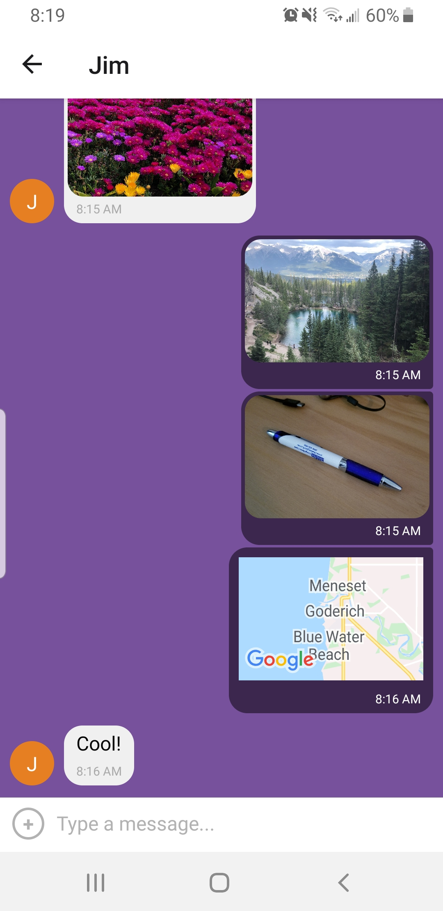
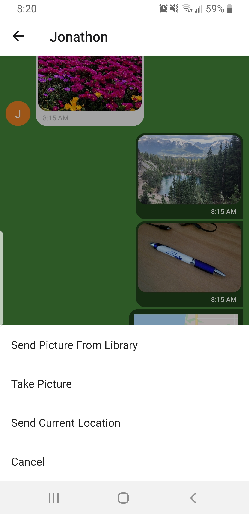
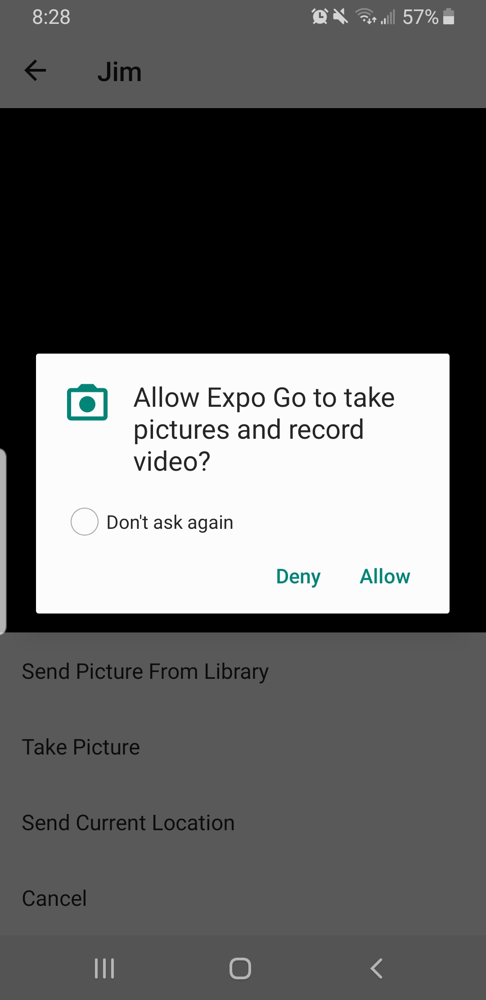

<h2>Hello World Chat Application</h2>

This is a React Native Chat application for both Android and iOS devices built using React Native.

<h3>Technologies Used</h3>
<ul>
  <li>React-Native</li>
  <li>Expo</li>
  <li>Firebase</li>
</ul>

<h3>Key Features</h3>
<ul>
  <li>Home screen where users can enter their username and select a background color for the chat display</li>
  <li>Chat interface that allows users to send pictures from their media library or take a picture with their camera, as well as share their current location</li>
  <li>Chat Application uses in-build permission check to ask for permission before accessing location data, media library and camera</li>
</ul>

<h3>Getting Started</h3>

<h4>Requirements</h4>
<ul>
  <li>Node.js</li>
  <li>Expo Command Line Interface (CLI)</li>
</ul>
<code>npm install --global expo-cli</code>

<h4>Setup</h4>

Clone the repo or download the files, and install dependencies

<code>npm install</code>

<h4>Run the App</h4>

To get the app running use:

<code>expo start</code>

<b>NOTE:</b> You will need to setup an account with <a href="https://expo.dev/">Expo</a> before you can view your app and get it up and running.

<h4>Viewing the application</h4>

You can run this application on your mobile device by downloading the Expo app from your app store.

Alternatively you can run IOS Simulator through XCode or Android Studio.

<b>NOTE:</b> You will need to setup your own <a href="https://firebase.google.com/">firebase database</a>, you will need to setup your own firebase database and add your own database credentials in /components/chat.js, under the "Firebase Config Details", then allow anonymous authorization with your Database.

<h3>SCREENSHOTS</h3>

<h4>Home Screen</h4>

<h4>Chat Screen with different background</h4>

<table>
<tr>
<td></td>
<td></td>
<td></td>
</tr>
</table>

<h4>Chat Features</h4>

<h4>Permission Check</h4>

